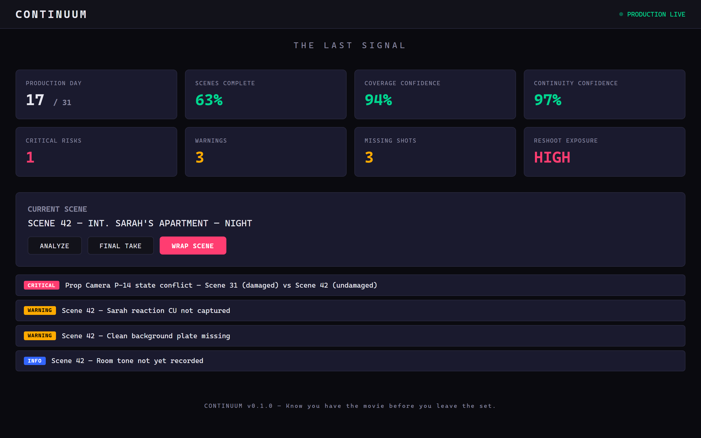
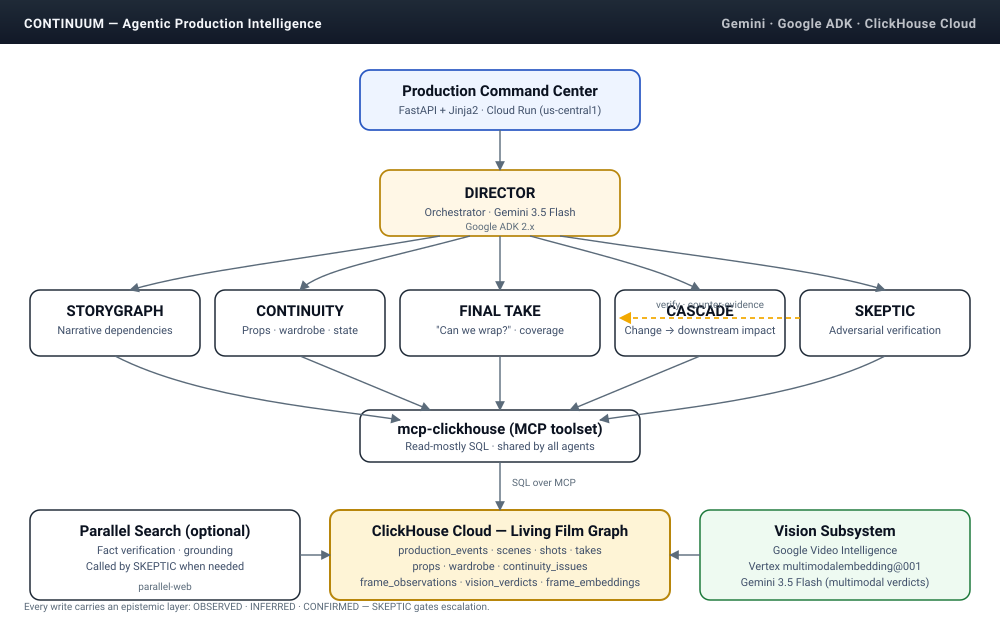

# CONTINUUM 🎬

**An agentic production-intelligence system for film.**

> *Know you have the movie before you leave the set.*

[](https://github.com/BenDuske/CONTINUUM/actions/workflows/ci.yml)
[](LICENSE)
[](https://python.org)
[](https://cloud.google.com)
[](https://clickhouse.com)

**🚀 Live demo:** [`https://continuum-882642985987.us-central1.run.app`](https://continuum-882642985987.us-central1.run.app) *(Google Cloud Run, us-central1)*

### Try it against the live deployment

Four curl calls, no clone required — hit the running Cloud Run instance:

```bash
BASE=https://continuum-882642985987.us-central1.run.app

# 1. Health — should return status=ok, clickhouse=connected
curl -s $BASE/health

# 2. FINAL TAKE — the signature wrap check on the seeded demo scene
curl -sX POST $BASE/api/production/tls-001/scene/scene-42/wrap-check

# 3. CONTINUITY — reason about prop / wardrobe state for Scene 33 (new)
curl -sX POST $BASE/api/production/tls-001/scene/scene-33/continuity-check

# 4. Free-form agent query (routed by DIRECTOR to the right specialist)
curl -sX POST $BASE/api/agent/query \
  -H "Content-Type: application/json" \
  -d '{"query":"Can we wrap scene-42 in production tls-001?","production_id":"tls-001"}'
```

Or replay history — reconstruct the Living Film Graph at any past moment
(ClickHouse's native time-travel over the event stream):

```bash
# State of the production 24 hours ago
curl -s "$BASE/api/production/tls-001/timeline?at=$(python -c 'import datetime;print((datetime.datetime.utcnow()-datetime.timedelta(hours=24)).isoformat())')"
```



*The Production Command Center — Scene 42 flagged with a CRITICAL prop-state
conflict (Camera P-14: damaged in Scene 31, undamaged in Scene 42), two
missing shots, and a room-tone gap. The **WRAP SCENE** button is the moment
the pipeline runs.*

---

## The Problem

Film productions don't have persistent machine-understandable memory.

A movie begins as one document — a screenplay — and explodes into thousands of interconnected decisions involving people, locations, props, wardrobe, shots, equipment, money, schedules, footage, and continuity. That information is scattered across scripts, PDFs, spreadsheets, emails, call sheets, photos, video, audio, notes, and people's memories.

When something changes, **humans manually propagate the consequences.**

The result:
- **Script changes create cascading production changes** that nobody fully traces
- **Continuity errors** surface in the edit bay, not on set
- **Missing coverage** is discovered after the location is struck
- **Production knowledge disappears** between departments and phases

These problems cost real productions real money in reshoots, delays, and post-production fixes.

## The Solution

**CONTINUUM** is an agentic production-intelligence system that maintains a **Living Film Graph** — a temporal, event-driven memory of the entire movie from screenplay through final cut.

It detects conflicts, predicts change impacts, verifies coverage, and coordinates corrective actions **before problems become reshoots.**

### Agent Network

CONTINUUM is a multi-agent system powered by **Gemini 3.5 Flash** and **Google Cloud Agent Development Kit (ADK)**:

| Agent | Responsibility |
|---|---|
| **DIRECTOR** | Orchestrator — routes queries to specialist agents |
| **STORYGRAPH** | Story logic and narrative dependency analysis |
| **CONTINUITY** | Visual/narrative state consistency (digital script supervisor) |
| **FINAL TAKE** | Coverage assessment — "Do we have the movie?" |
| **CASCADE** | Change-impact propagation — "What does this change break?" |
| **SKEPTIC** | Adversarial verification of agent conclusions |

### Three Epistemic Layers

CONTINUUM knows the difference between data, inference, and decision:

- **OBSERVED** — Detected directly from production data
- **INFERRED** — An agent believes this is true
- **CONFIRMED** — A human or authoritative system accepted it

Only findings that survive the SKEPTIC's adversarial challenge get escalated to the crew.

## Vision Subsystem

CONTINUUM includes a vision subsystem that gives CONTINUITY, FINAL TAKE,
and CASCADE eyes on the actual footage — not just the tabular metadata.

The Vision subsystem idea was inspired by our internal AVI pipeline, but
had to be completely redesigned to integrate Google's Vertex AI & Video
Intelligence.

| Google Service | Package | Role |
|---|---|---|
| Video Intelligence API | `google-cloud-videointelligence` | Shot / object / face / label / OCR / speech extraction from take video |
| Gemini 3.5 Flash (multimodal) | `google-genai` | Structured continuity verdicts on keyframes given screenplay context |
| Vertex AI `multimodalembedding@001` | `google-cloud-aiplatform` | 1408-dim image embeddings for nearest-frame lookup |
| Cloud Storage | `google-cloud-storage` | Take asset inputs and provenance sidecars |

Every observation carries provenance (source model, confidence, epistemic
layer) and lands in dedicated ClickHouse tables (`frame_observations`,
`take_dialogue`, `vision_verdicts`, `frame_embeddings`) that the existing
agents query through their MCP toolset.

Engines run in one of two modes selected by `CONTINUUM_VISION_ENGINE_MODE`:

- `stub` — deterministic fixtures, zero Google quota consumed. Used by the
  test suite and by the demo when credits are unavailable.
- `real` — actual Google Cloud calls.

### Try vision on a clip

CONTINUUM ships with a runnable driver — `scripts/run_vision_real.py` —
that fires all three Google Cloud engines against a take asset in GCS and
prints what would land in ClickHouse (dry-run by default). Point it at the
bundled demo take or your own clip:

```bash
# Dry-run against the bundled demo asset (scene-42, take-03).
python scripts/run_vision_real.py

# One engine at a time.
python scripts/run_vision_real.py --engine gemini_multimodal
python scripts/run_vision_real.py --engine video_intelligence
python scripts/run_vision_real.py --engine imagen_embed

# Real ClickHouse writes (needs CLICKHOUSE_HOST/USER/PASSWORD in the env).
python scripts/run_vision_real.py --write

# Your own clip in GCS.
python scripts/run_vision_real.py --gcs gs://your-bucket/take.mp4
```

Required env (real mode):

- `GOOGLE_APPLICATION_CREDENTIALS` — service-account JSON path
- `GOOGLE_CLOUD_PROJECT`
- `CONTINUUM_VISION_LOCATION` (defaults to `us-central1`)
- `CONTINUUM_GCS_BUCKET`
- `CONTINUUM_GEMINI_BACKEND=vertex` *or* `GOOGLE_GENAI_API_KEY`

Related files: `src/continuum/vision/`, `src/continuum/schema/migrations/002_vision.sql`,
`src/continuum/tools/vision_tools.py`, `src/continuum/web/vision_routes.py`,
`compliance/vision_blueprint_note.md`.

## Architecture



The DIRECTOR agent routes each request to the specialists that can answer it.
Every read and write goes through the shared `mcp-clickhouse` toolset into the
Living Film Graph. The SKEPTIC challenges other agents' conclusions before
they escalate to the crew, and every observation carries an epistemic layer
(OBSERVED / INFERRED / CONFIRMED) so the interface can show its work.

### Technology Stack

| Component | Technology | Role |
|---|---|---|
| **AI Intelligence** | Gemini 3.5 Flash (`google-genai`) | All reasoning and analysis |
| **Agent Framework** | Google Cloud ADK 2.x (`google-adk`) | Multi-agent orchestration |
| **Production Memory** | ClickHouse Cloud (`mcp-clickhouse`) | Event stream + Living Film Graph |
| **External Research** | Parallel Search API (`parallel-web`) | Fact verification, research grounding |
| **Web Interface** | FastAPI + Jinja2 | Production Command Center |
| **Deployment** | Google Cloud Run | Serverless hosting |

## Quick Start

### Prerequisites

- Python 3.10+
- A [Google Cloud](https://cloud.google.com/free) account with Gemini API access
- A [ClickHouse Cloud](https://clickhouse.com/cloud) account ($400 free credits for new accounts)
- A [Parallel](https://parallel.ai) API key (optional)

### Installation

```bash
# Clone the repository
git clone https://github.com/BenDuske/CONTINUUM.git
cd CONTINUUM

# Create virtual environment
python3 -m venv .venv
source .venv/bin/activate

# Install dependencies
pip install -e ".[dev]"

# Configure environment
cp .env.example .env
# Edit .env with your API keys and ClickHouse credentials

# Initialize ClickHouse schema
python scripts/init_db.py

# Load sample production data
python scripts/load_sample_data.py

# Run the application
python -m uvicorn continuum.web.app:app --host 0.0.0.0 --port 8000
```

Visit `http://localhost:8000` to see the Production Command Center.

### API Endpoints

| Endpoint | Method | Description |
|---|---|---|
| `/` | GET | Production Command Center dashboard |
| `/health` | GET | Health check (includes ClickHouse connectivity) |
| `/api/production/{id}/status` | GET | Production metrics from ClickHouse |
| `/api/production/{id}/scenes` | GET | List scenes with status |
| `/api/production/{id}/scene/{id}` | GET | Scene detail with shots and takes |
| `/api/production/{id}/timeline?at=` | GET | Reconstruct the Living Film Graph at any past moment (ClickHouse time-travel over the event stream) |
| `/api/agent/query` | POST | Free-form agent query (Gemini + MCP) |
| `/api/production/{id}/scene/{id}/wrap-check` | POST | FINAL TAKE wrap assessment |
| `/api/production/{id}/scene/{id}/continuity-check` | POST | Continuity analysis |
| `/api/production/{id}/cascade` | POST | CASCADE change-impact analysis |

## Demo Scenario: "The Last Signal"

CONTINUUM ships with a sample sci-fi production — *THE LAST SIGNAL* (47 scenes) — demonstrating the full agent pipeline:

1. **Scene 31**: Sarah drops Camera P-14 during the first signal event. The camera is now **damaged** (cracked lens, dented body).
2. **Scene 42**: Sarah enters her apartment with the damaged camera. 8 shots planned, but only 6 captured (42G and 42H missing).
3. **Ask CONTINUUM**: "Can we wrap Scene 42?"
4. **Watch** the agent pipeline work:
   - **FINAL TAKE** queries ClickHouse for shots and takes → finds 2 uncaptured shots
   - **CONTINUITY** checks prop states → confirms Camera P-14 must show damage
   - **SKEPTIC** verifies the finding → CONFIRMED
   - **Verdict**: 🔴 NOT SAFE TO WRAP — missing coverage + continuity risk

### Try It

```bash
# Query the agent pipeline directly
curl -X POST http://localhost:8000/api/agent/query \
  -H "Content-Type: application/json" \
  -d '{"query": "Can we wrap scene-42 in production tls-001?", "production_id": "tls-001"}'

# Run the signature wrap check
curl -X POST http://localhost:8000/api/production/tls-001/scene/scene-42/wrap-check
```

## Project Structure

```
CONTINUUM/
├── src/continuum/
│   ├── agents/          # ADK agent definitions
│   │   ├── director.py  # Orchestrator (routes to sub-agents)
│   │   ├── storygraph.py
│   │   ├── continuity.py
│   │   ├── final_take.py
│   │   ├── cascade.py
│   │   └── skeptic.py
│   ├── runner.py        # ADK Runner + MCP initialization
│   ├── config.py        # Environment-based configuration
│   ├── schema/          # Pydantic models + ClickHouse DDL
│   ├── tools/           # ClickHouse query functions
│   ├── mcp/             # mcp-clickhouse MCP server config
│   └── web/             # FastAPI dashboard + API
├── data/                # Sample production data (THE LAST SIGNAL)
├── tests/               # Test suite
├── compliance/          # Hackathon compliance evidence
├── scripts/             # DB init, data loading
├── Dockerfile           # Cloud Run deployment
└── pyproject.toml       # Dependencies
```

## License

Apache License 2.0 — see [LICENSE](LICENSE).

## Author

**Benjamin Duske** — [Digital Real-Estate Frontier, LLC](https://digitalrealestatefrontier.com)

Built for the [Agentic Cinema Hackathon](https://agentic-cinema.devpost.com/) (Google Cloud + ClickHouse Track).
